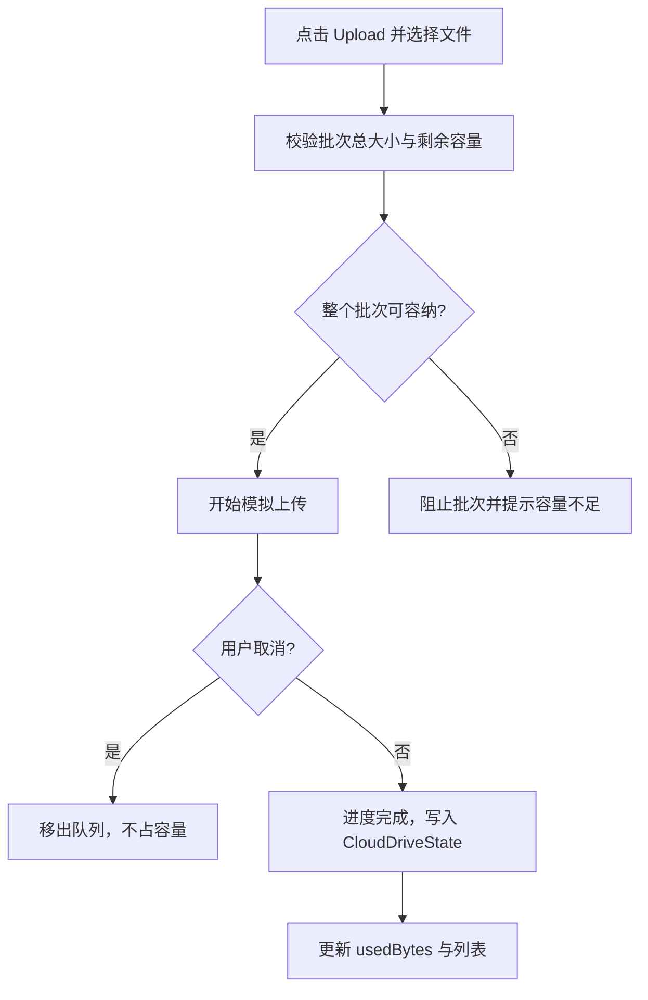
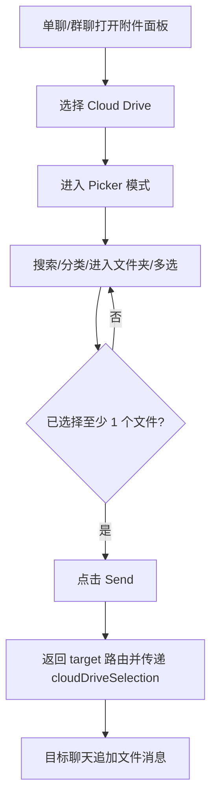
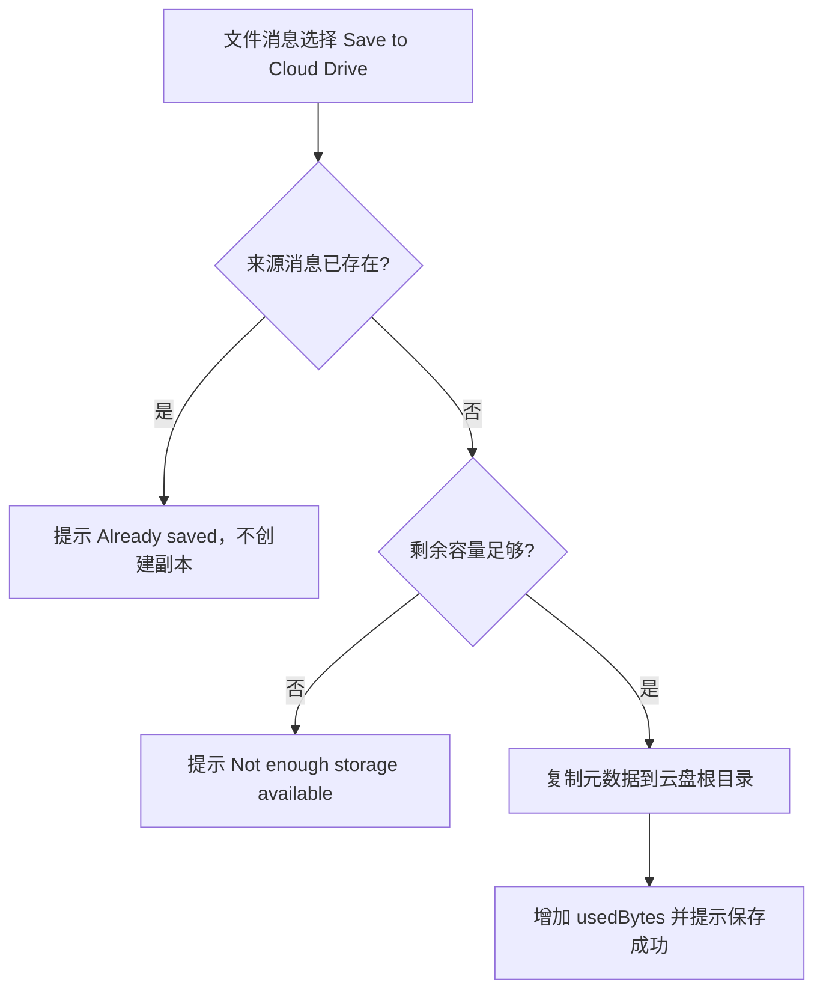
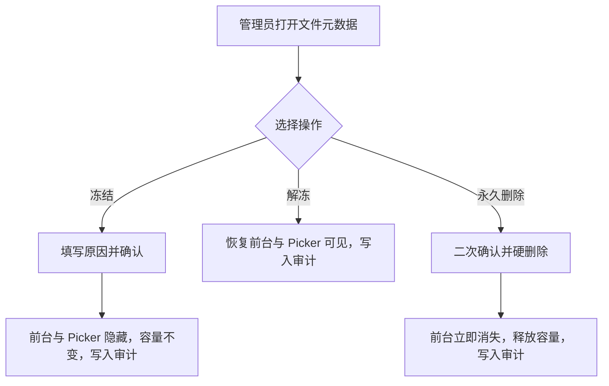

# 产品需求文档（PRD）：SuperIM v1.2 云盘

**产品名称：** SuperIM  
**版本：** V1.2（界面版本号 `v1.2.0`）  
**文档状态：** 设计确认  
**最后更新：** 2026-08-11  
**范围：** SuperIM 用户端与管理端前端原型（Mock-only）

---

## 1. 背景与目标

### 1.1 背景问题

v1.1 已提供聊天文件、Saved Messages 和消息转发能力，但文件仍散落在各个会话中：用户难以集中查找、跨会话复用或长期管理文件。Saved Messages 是“发给自己的消息流”，适合收藏上下文和随手笔记，不承担结构化文件管理职责。

### 1.2 产品目标

1. 新增独立的个人云盘，形成“上传或收存文件 → 分类/文件夹管理 → 预览 → 再次发送”的完整闭环。
2. 在 Me、正式单聊和群聊中提供低成本入口，允许聊天文件一键收存、云盘文件快速回发。
3. 保持 Cloud Drive 与 Saved Messages 彼此独立，并通过文件收存和转发目标实现互通。
4. 以可验收的前端 Mock 原型明确页面、交互、数据模型及异常状态，为后续真实服务设计提供依据。
5. 为管理员提供容量、文件生命周期、用户配额和操作审计能力，形成云盘运营闭环。

### 1.3 成功标准

1. 用户可从 Me 进入 Cloud Drive，并在三条云盘路由间完成浏览、管理和预览。
2. 用户可上传文件、新建一级文件夹，并对一个或多个文件执行移动、发送和永久删除。
3. 正式单聊和群聊可从附件面板多选云盘文件并生成文件消息。
4. 正式单聊、群聊和 Saved Messages 的文件消息可收存至云盘，重复收存不会产生副本。
5. 初始容量正确显示为 `3.2 GB of 10 GB used`，上传和删除后容量同步变化。
6. 管理员可从侧边栏进入云盘总览、文件管理、用户配额和操作审计四个后台页面。
7. 后台冻结、解冻和永久删除能同步影响用户端云盘与 Picker；冻结文件仍计入容量，删除后立即释放容量。
8. 全局配额、单用户配额修改、文件状态变更和永久删除均可在审计页查询。

### 1.4 非目标

本期不包含：

- 独立权限系统；后台云盘权限沿用现有管理员入口。
- 真实后端、对象存储、网络上传、数据库、鉴权或多端同步。
- 回收站、软删除、文件恢复、文件版本、离线文件或断点续传。
- 公开分享链接、访问密码、团队空间或多人协作权限。
- 多级文件夹；文件夹只允许一级，不能在文件夹中创建子文件夹。
- 临时会话接入；`/temp-chat/:userId` 不展示 Cloud Drive 或 Save to Cloud Drive。

### 1.5 管理端云盘运营管理

v1.2 同步提供独立的云盘后台运营模块，形成容量与文件生命周期的运营闭环。后台沿用现有管理员入口和 `AdminSidebar + PC 管理工作台`，使用 Mock 数据，不接触文件正文。

| 页面 | 路径 | 核心能力 |
| --- | --- | --- |
| 云盘运营总览 | `/admin/cloud-drive` | 总容量、已用容量、用户/文件数、冻结数、操作趋势、类型分布、高占用用户、容量预警与异常入口 |
| 文件管理 | `/admin/cloud-drive/files` | 文件元数据搜索、筛选、排序、分页、抽屉查看、冻结/解冻、永久删除 |
| 用户存储配额 | `/admin/cloud-drive/quotas` | 10 GB 全局默认配额、单用户覆盖、已用空间校验、覆盖清除 |
| 操作审计 | `/admin/cloud-drive/audit` | 只读查询配额和文件变更记录，记录操作人、原因、前后值与结果 |

后台约束：不提供文件正文预览和下载；冻结文件从用户云盘和 Picker 隐藏但仍计入容量，解冻后恢复；永久删除立即硬删除并释放容量。所有配额修改、冻结、解冻、永久删除和批量操作必须写入审计日志。

---

## 2. 用户角色与核心场景

| 角色 | 核心诉求 | 典型场景 |
| --- | --- | --- |
| 已登录用户 | 集中保存与管理个人文件 | 从 Me 进入云盘、上传、分类、移动、删除 |
| 聊天用户 | 快速复用云盘文件 | 在单聊/群聊附件面板选择云盘文件发送 |
| 内容收藏用户 | 在消息与文件管理之间流转内容 | 将聊天/Saved Messages 文件收存到云盘，或把云盘文件发送到 Saved Messages |
| 管理员 | 维护云盘容量和文件生命周期 | 查看运营总览、处理冻结/删除、调整配额、追踪审计记录 |

---

## 3. 用户故事

### US-01 进入并浏览个人云盘

**As a** 已登录用户  
**I want to** 从 Me 进入独立的 Cloud Drive  
**So that** 我可以集中查看存储容量、文件夹和最近文件

**验收标准**

1. Given 用户位于 `/me`  
   When 点击位于 Saved Messages 后的 `Cloud Drive`  
   Then 进入 `/cloud-drive`，且现有五栏底部导航不变。
2. Given 用户首次进入云盘  
   When 首页加载完成  
   Then 显示 `3.2 GB of 10 GB used`、分类入口、一级文件夹和最近文件。
3. Given 用户输入搜索词  
   When 文件名或文件夹名包含该词（忽略大小写）  
   Then 页面仅显示匹配结果；无结果时显示 `No matching files or folders`。

### US-02 上传文件与新建文件夹

**As a** 已登录用户  
**I want to** 上传本地文件并创建文件夹  
**So that** 我可以补充和组织云盘内容

**验收标准**

1. Given 用户位于管理模式  
   When 点击 `Upload` 并选择一个或多个文件  
   Then 显示批次模拟进度；完成后文件写入当前目录并更新已用容量。
2. Given 待上传文件的合计大小大于剩余容量  
   When 系统校验该批次  
   Then 阻止整个批次并显示 `Not enough storage available`。
3. Given 文件正在上传  
   When 用户点击 `Cancel`  
   Then 该文件变为取消状态、不写入云盘且不占用容量。
4. Given 用户点击 `New Folder`  
   When 输入合法且不重复的名称并确认  
   Then 在根目录创建一级文件夹；文件夹页面内不提供新建子文件夹入口。

### US-03 管理单个或多个文件

**As a** 已登录用户  
**I want to** 重命名、移动、发送或删除云盘文件  
**So that** 云盘内容保持有序并可重复利用

**验收标准**

1. Given 用户打开文件操作菜单  
   When 选择 `Rename`  
   Then 可修改文件名，空名称不可提交。
2. Given 用户选择一个或多个文件  
   When 点击 `Move`  
   Then 可移动到根目录或任一其他一级文件夹，且容量不变。
3. Given 用户选择一个或多个文件  
   When 点击 `Send`  
   Then 跳转 `/forward-message`，并把所选云盘文件作为待发送内容；Saved Messages 仍是可选目标。
4. Given 用户选择一个或多个文件并点击 `Delete`  
   When 在确认弹窗点击 `Delete permanently`  
   Then 文件立即永久删除、已用容量立即减少，且不进入回收站。

### US-04 预览与下载文件

**As a** 已登录用户  
**I want to** 查看文件内容和元数据  
**So that** 我可以在管理或发送前确认文件

**验收标准**

1. Given 文件类型为图片、视频、音频或 PDF  
   When 进入 `/cloud-drive/file/:fileId`  
   Then 展示对应的模拟预览控件和文件元数据。
2. Given 文件类型为文档、压缩包或其他类型  
   When 进入详情页  
   Then 展示类型图标、文件名、大小、来源、位置和时间，不伪造正文预览。
3. Given 用户点击 `Download`  
   When 原型执行模拟下载  
   Then 生成同名占位文件并显示 `Download started`。

### US-05 从聊天附件发送云盘文件

**As a** 正式聊天用户  
**I want to** 从附件面板选择云盘文件  
**So that** 我可以无需重新上传就把文件发给联系人或群聊

**验收标准**

1. Given 用户位于 `/chatroom` 或 `/group-chat`  
   When 打开附件面板并点击 `Cloud Drive`  
   Then 分别进入 `/cloud-drive?mode=picker&target=chatroom` 或 `/cloud-drive?mode=picker&target=group-chat`。
2. Given 用户处于 Picker 模式  
   When 在当前文件列表选择一个或多个文件并点击 `Send`  
   Then 返回目标聊天，并通过路由 state `cloudDriveSelection: CloudFile[]` 追加对应文件消息。
3. Given 用户处于 Picker 模式  
   When 浏览云盘  
   Then 可搜索、分类、进入文件夹和多选文件，但看不到上传、新建、重命名、移动或删除入口。
4. Given 用户位于临时会话  
   When 打开附件面板或文件消息菜单  
   Then 不出现 Cloud Drive 或 Save to Cloud Drive。

### US-06 将消息文件收存到云盘

**As a** 聊天或 Saved Messages 用户  
**I want to** 把文件消息收存到云盘  
**So that** 我可以将重要文件纳入统一管理

**验收标准**

1. Given 正式单聊、群聊或 Saved Messages 中存在文件消息  
   When 打开文件消息菜单并点击 `Save to Cloud Drive`  
   Then 文件保存到云盘根目录，并显示 `Saved to Cloud Drive`。
2. Given 同一来源消息已收存  
   When 再次点击 `Save to Cloud Drive`  
   Then 不创建副本、不增加容量，并显示 `Already saved to Cloud Drive`。
3. Given 收存文件大小超过剩余容量  
   When 用户点击 `Save to Cloud Drive`  
   Then 不保存文件，并显示 `Not enough storage available`。
4. Given 文件已收存至 Cloud Drive  
   When 用户删除 Saved Messages 中的原消息  
   Then 云盘副本不受影响；反向删除云盘文件也不删除原消息。

---

## 4. MVP 范围

| 优先级 | 用户活动 | 能力 | 本期纳入 |
| --- | --- | --- | --- |
| Must | 浏览 | 容量、搜索、分类、文件夹、最近文件 | 是 |
| Must | 添加 | 多文件上传、模拟进度、取消、新建一级文件夹 | 是 |
| Must | 管理 | 预览、下载、重命名、移动、永久删除 | 是 |
| Must | 批量处理 | 批量移动、发送、永久删除 | 是 |
| Must | 聊天集成 | Me 入口、单聊/群聊附件 Picker、文件消息收存 | 是 |
| Must | Saved Messages 互通 | 收存 Saved 文件、作为转发目标 | 是 |
| Must | 管理端运营 | 总览、文件元数据管理、用户配额、操作审计 | 是 |
| Won't | 恢复与分享 | 回收站、版本、公开链接、团队空间 | 否 |
| Won't | 系统能力 | 真实后端、真实文件持久化、独立权限系统 | 否 |

---

## 5. 页面与入口模型

| 页面/区域 | 路径 | 模式与职责 |
| --- | --- | --- |
| Cloud Drive 首页 | `/cloud-drive` | 管理模式：容量、搜索、分类、文件夹、最近文件、上传、新建文件夹 |
| Cloud Drive 首页 | `/cloud-drive?mode=picker&target=chatroom\|group-chat` | Picker 模式：浏览、搜索、分类、多选并发送 |
| 文件夹内容 | `/cloud-drive/folder/:folderId` | 管理模式：排序、单选/多选、移动、发送、永久删除 |
| 文件详情 | `/cloud-drive/file/:fileId` | 模拟预览、元数据、下载、重命名、移动、发送、永久删除 |
| Me | `/me` | 在 Saved Messages 后新增 `Cloud Drive`；About 版本显示 `v1.2.0` |
| 正式单聊 | `/chatroom` | 附件面板新增 `Cloud Drive`；文件消息菜单新增 `Save to Cloud Drive` |
| 群聊 | `/group-chat` | 附件面板新增 `Cloud Drive`；文件消息菜单新增 `Save to Cloud Drive` |
| Saved Messages | `/favorites` | 文件消息菜单新增 `Save to Cloud Drive`，自身仍是独立消息流 |
| 转发选择器 | `/forward-message` | 接收云盘文件作为待发送内容，保留 Saved Messages 目标 |

### 5.1 管理端页面

| 页面/区域 | 路径 | 模式与职责 |
| --- | --- | --- |
| 云盘运营总览 | `/admin/cloud-drive` | 容量健康、运营指标、类型占用、高占用用户、趋势和异常入口 |
| 文件管理 | `/admin/cloud-drive/files` | 文件元数据搜索、筛选、排序、分页、状态操作和硬删除 |
| 用户存储配额 | `/admin/cloud-drive/quotas` | 全局默认配额、单用户覆盖、已用空间校验和覆盖清除 |
| 操作审计 | `/admin/cloud-drive/audit` | 只读查询管理员、目标、原因、前后值、结果和关联 ID |

文件夹页在 Picker 模式下透传 `mode` 与 `target` 查询参数；每个列表视图独立完成多选并发送。

---

## 6. 数据模型与接口约定

### 6.1 共享类型

```ts
type CloudFileCategory =
  | 'image'
  | 'video'
  | 'audio'
  | 'document'
  | 'archive'
  | 'other';

type CloudFileSource = 'upload' | 'chat';

interface CloudFile {
  id: string;
  name: string;
  category: CloudFileCategory;
  mimeType: string;
  sizeBytes: number;
  parentFolderId: string | null; // null 表示根目录
  source: CloudFileSource;
  sourceMessageId?: string;      // 聊天收存时用于去重
  sourceChat?: string;
  previewUrl?: string;           // 仅用于模拟预览
  status?: 'active' | 'frozen';  // 后台冻结后，用户端和 Picker 不显示
  frozenAt?: string;
  frozenReason?: string;
  createdAt: string;             // ISO 8601
  updatedAt: string;             // ISO 8601
}

interface CloudFolder {
  id: string;
  name: string;
  createdAt: string;
}

interface CloudDriveState {
  files: CloudFile[];
  folders: CloudFolder[];
  totalBytes: number;
}
```

`fileCount` 与 `usedBytes` 均从 `files` 派生，不作为独立字段持久化。

### 6.2 存储与容量

- LocalStorage key：`superim-cloud-drive-state-v1`。
- `totalBytes`：`10_737_418_240`（10 GiB）。
- 初始种子文件合计约 3.2 GiB，界面显示为 `3.2 GB`。
- `usedBytes` 必须等于已持久化文件的 `sizeBytes` 之和，包含状态为 `frozen` 的文件；上传/收存成功后增加，永久删除后减少，移动/重命名/发送不改变容量。
- 用户端列表、文件夹和 Picker 只展示 `status !== 'frozen'` 的文件；解冻后恢复显示和使用。
- 文件列表和文件夹操作持久化；真实文件二进制不持久化，上传文件刷新后使用类型图标或模拟预览占位。

### 6.3 文件分类规则

| 分类文案 | `CloudFileCategory` | 常见 MIME / 扩展名 |
| --- | --- | --- |
| Images | `image` | `image/*` |
| Videos | `video` | `video/*` |
| Audio | `audio` | `audio/*` |
| Documents | `document` | PDF、DOC/X、XLS/X、PPT/X、TXT、CSV |
| Other | `archive`, `other` | ZIP/RAR/7Z 及未识别类型 |

### 6.4 路由数据契约

```ts
interface CloudDrivePickerLocationState {
  cloudDriveSelection: CloudFile[];
}

```

- Picker `target=chatroom` 返回 `/chatroom`；`target=group-chat` 返回 `/group-chat`。
- 管理模式下 `Send` 跳转 `/forward-message?source=cloud-drive&fileIds=...`。
- 聊天页接收 Picker state 后，为每个文件追加一条文件消息，并在消费后清理 location state，避免刷新或返回时重复追加。
- 聊天收存通过 `sourceMessageId` 去重。

### 6.5 管理端数据模型

后台使用独立的 Mock 运营状态，并复用 `CloudFile`、`CloudFolder` 和容量计算逻辑。

```ts
interface AdminCloudDriveSummary {
  totalStorageBytes: number;
  usedStorageBytes: number;
  userCount: number;
  fileCount: number;
  frozenFileCount: number;
  uploadCount: number;
  deleteCount: number;
}

interface AdminCloudFileRecord {
  fileId: string;
  name: string;
  category: CloudFileCategory;
  sizeBytes: number;
  ownerUserId: string;
  ownerName: string;
  source: CloudFileSource;
  folderName: string | null;
  status: 'active' | 'frozen';
  updatedAt: string;
  frozenAt?: string;
  frozenReason?: string;
}

interface AdminCloudUserQuota {
  userId: string;
  userName: string;
  defaultQuotaBytes: number;
  overrideQuotaBytes?: number;
  usedBytes: number;
  fileCount: number;
  lastUploadedAt?: string;
  status: 'active' | 'frozen';
}

interface AdminCloudDriveAuditRecord {
  id: string;
  action: 'quota.update' | 'file.freeze' | 'file.unfreeze' | 'file.delete';
  operatorName: string;
  targetId: string;
  targetName: string;
  reason: string;
  before?: string;
  after?: string;
  result: 'success' | 'failed';
  createdAt: string;
}
```

- 默认用户配额为 10 GB；单用户覆盖值优先于全局默认值，清除覆盖后恢复全局默认值。
- 修改后的单用户配额不能低于该用户已用空间；全局默认配额不能低于无覆盖用户的已用空间。
- 后台文件管理只处理元数据，不显示正文预览、不提供下载。
- 冻结必须填写原因；永久删除需要二次确认并立即硬删除。
- 全局配额、单用户配额、冻结、解冻、永久删除和批量操作均写入审计记录；批量操作按目标对象分别记录。

---

## 7. 核心业务流程

### 7.1 上传与容量校验



### 7.2 聊天附件 Picker



### 7.3 从消息收存



### 7.4 管理端文件生命周期



---

## 8. 状态、校验与异常

### 8.1 页面状态

| 状态 | 展示与行为 |
| --- | --- |
| Ready | 展示容量、目录和文件；允许当前模式支持的操作 |
| Empty | 首页显示 `Your Cloud Drive is empty`；文件夹显示 `This folder is empty` |
| Search empty | 显示 `No matching files or folders`，保留清除搜索入口 |
| Uploading | 上传面板显示文件名、进度和 `Cancel` |
| Capacity error | Toast `Not enough storage available`，不修改已持久化数据 |
| Missing resource | folder/file ID 不存在时显示 `Folder not found` / `File not found` 和 `Back to Cloud Drive` |

### 8.2 命名校验

- 文件夹名称去除首尾空格后长度为 1–40 个字符；同级名称不区分大小写且不可重复。
- 文件重命名去除首尾空格后不可为空。

### 8.3 永久删除

- 单文件确认文案：`Delete “{fileName}” permanently? This action cannot be undone.`
- 批量确认文案：`Delete {count} files permanently? This action cannot be undone.`

### 8.4 管理端状态

| 状态 | 展示与行为 |
| --- | --- |
| Frozen | 后台显示冻结原因；用户端云盘和 Picker 隐藏，容量仍计入 |
| Deleted | 文件记录被立即移除，容量释放；不进入回收站且不可恢复 |
| Audit read-only | 审计页可搜索、筛选、分页和查看详情，不允许删除或修改记录 |

---

## 9. 视觉与非功能要求

1. 使用 `src/themes/equatorial-minimalism` 主题；标题使用 Montserrat，正文使用 Inter，颜色与间距只引用现有 Token。
2. 移动端优先，基准画布为 `400 × 852`；桌面预览限制内容最大宽度，避免信息过度拉伸。
3. 用户端界面可见文案使用英文；管理端沿用现有后台中文导航和运营文案；PRD 和 spec 正文可使用中文。
4. 可点击图标提供可识别标签或 `aria-label`；键盘焦点可见，文本与背景对比度满足 WCAG 2.1 AA。
5. 所有上传、预览、下载和跨页状态均为前端模拟，不发起真实文件网络请求。

---

## 10. 验收清单（Definition of Done）

- [ ] 新增 `/cloud-drive`、`/cloud-drive/folder/:folderId`、`/cloud-drive/file/:fileId` 三条路由对应规格和原型。
- [ ] 初始容量为 10 GB、已用 3.2 GB；上传/收存/永久删除会同步更新容量。
- [ ] 首页支持搜索、Images/Videos/Audio/Documents/Other 分类、一级文件夹和最近文件。
- [ ] 上传支持多选、批次模拟进度、取消和容量不足提示。
- [ ] 文件支持模拟预览、下载、重命名、移动、发送和永久删除。
- [ ] 文件夹页支持排序、单选/多选，以及批量移动、发送和永久删除。
- [ ] Me 在 Saved Messages 后展示 Cloud Drive，版本文案为 `SuperIM v1.2.0`，底部五栏导航不变。
- [ ] `/chatroom` 与 `/group-chat` 附件面板可进入 Picker 并接收多选文件消息。
- [ ] `/chatroom`、`/group-chat`、`/favorites` 的文件消息可 Save to Cloud Drive，重复保存不创建副本。
- [ ] 云盘管理模式发送复用 `/forward-message`，Saved Messages 仍可作为目标。
- [ ] Picker 隐藏上传、新建、重命名、移动和删除；临时会话无任何云盘入口。
- [ ] 管理端可从侧边栏进入云盘总览、文件管理、用户配额和操作审计四个页面，当前菜单正确高亮。
- [ ] 文件管理支持元数据搜索、筛选、排序、分页、抽屉查看、冻结/解冻和永久删除；抽屉不出现预览和下载按钮。
- [ ] 冻结文件从用户端和 Picker 隐藏但容量不变，解冻恢复显示，永久删除释放容量。
- [ ] 全局配额、单用户覆盖和清除覆盖规则正确生效，不能低于已用空间。
- [ ] 所有后台变更操作均可在只读审计页查询；本期不实现真实后端、真实对象存储、回收站、共享链接、版本或团队空间。
