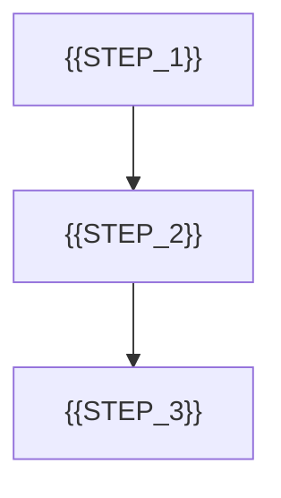

# 业务流程模板

> 适用场景：项目有明确业务链路、角色协作、状态推进或关键路径时使用。
> 可不生成/可合并：若流程很短，可合并到项目说明清单或状态文档；若核心是页面导航而非业务流，可优先生成页面地图。

## 1. 文档目标

- 说明关键业务流程、触发条件与结果输出
- 帮助后续页面设计、数据设计与状态设计保持一致

## 2. 真实业务流程

> 本节描述正式产品的业务路径、规则和结果，不以原型代码中的点击顺序作为真实依据。

## 3. 真实流程说明

| 步骤 ID | 触发者 | 输入/前置条件 | 真实处理与数据读写 | 输出/结果 | 状态变化 | 需求/验收 ID |
|------|------|------|------|------|------|------|
| `STEP-01` | `{{ACTOR}}` | `{{INPUT}}` | `{{REAL_PROCESSING}}` | `{{OUTPUT}}` | `{{STATE_CHANGE}}` | `{{SOURCE_ID}}` |

## 4. 原型演示路径与边界

| 步骤 ID | 原型表现 | Mock 数据 / 状态 | 正式业务对应 | 仅用于演示的部分 |
|------|------|------|------|------|
| `STEP-01` | `{{PROTOTYPE_BEHAVIOR}}` | `{{MOCK_DATA_OR_STATE}}` | `{{REAL_STEP_ID_OR_RULE}}` | `{{DEMO_ONLY_BEHAVIOR}}` |

> `SOURCE_ID` 一次填写一个明确编号，例如 `FR-01`、`INT-01` 或 `AC-01-01`。

**冲突处理**：原型路径与真实业务流程不一致时，以真实业务流程为准；原型只用于表达页面和演示交互，差异必须记录为待确认或未实现项。

## 5. 异常与待确认

- **异常路径**：`{{EXCEPTION_PATH}}`
- **重试 / 回滚**：`{{RETRY_OR_ROLLBACK}}`
- **待确认项**：`{{EXCEPTION_OR_OPEN_ISSUE}}`
