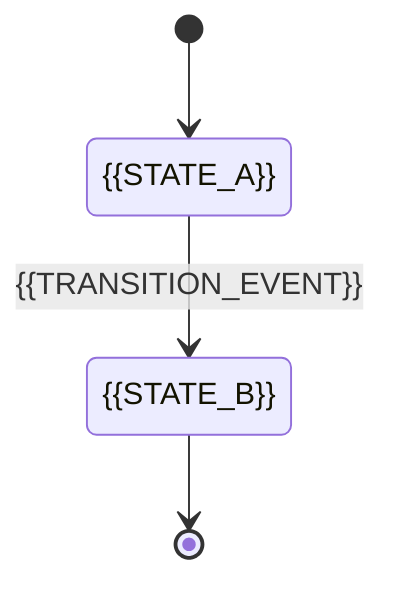

# 状态与生命周期模板

> 适用场景：项目存在业务状态流转、审批状态、任务生命周期或对象阶段变化时使用。
> 可不生成/可合并：若状态极少或已包含在业务流程文档中，可跳过；也可与业务流程文档合并。

## 1. 文档目标

- 说明对象从创建到结束的状态变化规则
- 帮助页面、数据、流程对齐状态口径

## 2. 真实状态流转

> 本节定义正式业务状态。原型中的 loading、假成功或静态状态不应直接成为业务生命周期。

## 3. 状态说明与页面映射

| 状态 ID | 状态 | 状态性质 | 进入条件 | 可执行动作 | 退出条件 | 页面状态 ID | 需求/验收 ID |
|------|------|------|------|------|------|------|------|
| `STATE-01` | `{{STATE_NAME}}` | `{{PRODUCTION}}` | `{{ENTER_CONDITION}}` | `{{AVAILABLE_ACTIONS}}` | `{{EXIT_CONDITION}}` | `{{PS-01}}` | `{{SOURCE_ID}}` |

## 4. 原型状态映射

| 原型状态 ID | 原型表现 | Mock 触发方式 | 真实状态 ID | 仅用于演示 / 未实现项 |
|------|------|------|------|------|
| `MOCK-STATE-01` | `{{PROTOTYPE_STATE}}` | `{{MOCK_TRIGGER}}` | `{{STATE-01}}` | `{{DEMO_ONLY_OR_UNIMPLEMENTED}}` |

> `SOURCE_ID` 一次填写一个明确编号，例如 `FR-01`、`STATE-01` 或 `AC-01-01`。

## 5. 异常与待确认

- **非法状态转移**：`{{INVALID_TRANSITION}}`
- **恢复 / 回滚规则**：`{{RECOVERY_OR_ROLLBACK}}`
- **待确认项**：`{{OPEN_ISSUE}}`
